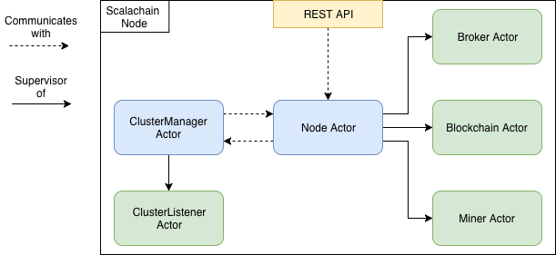

[](https://travis-ci.org/elleFlorio/scalachain)

# Scalachain
Scalachain is a blockchain implemented using the Scala programming language and the actor model (Akka Framework). The main purpose of the project is:

* Understand how a simple blockchain works 
* Learn the Scala programming language and Akka
* Share what I learned

For this reason, any contribution is welcome! :-)

I will try to write some short but specific articles about the development of the different part of the project. The roadmap is the following, but it may change during time:
* Scalachain - Functional Actor Based Blockchain
* Scalachain - Blockchain implementation in Scala
* Scalachain - The Actor Model
* Scalachain - Broker, a Simple Actor
* Scalachain - Miner, an Actor with Different States
* Scalachain - Blockchain, a Persistent Actor
* Scalachain - Node, an Actor to Rule Them All
* Scalachain - REST API with Akka HTTP

### TL;DR
Run the Scalachain node using ```sbt``` (```sbt run```) or the Docker container (see ```/docker``` folder).
The API to interact with Scalachain are documented [here](https://documenter.getpostman.com/view/4636741/RWaHw8yx).

### Quick introduction to the blockchain
There a lot of good articles that explain how a blockchain works, so I will do a high level introduction just to provide some context to this project.

The blockchain is a distributed ledger: it registers some transaction of values (e.g., coins) between a sender and a receiver. What makes a blockchain different from a traditional database is the decentralized nature of the blockchain: it is distributed among several communicating nodes that guarantee the validity of the transactions registered.

To accomplish this goal, the blockchain stores transactions in blocks, that are created (mined) by nodes investing some computational power. Every block is created by solving a cryptographic puzzle that is hard to solve, but easy to verify. In this way, every block represents a certain amount of work - the work needed to solve the cryptographic puzzle. This is the reason why the cryptographic puzzle is called the Proof of Work: The solution of the puzzle is the proof that a node spent a certain amount of work to solve it and mine the block.
The reason why nodes invest computational power to mine a block, is that the creation of a new block is rewarded by a predefined amount of coins. In this way nodes are encouraged to mine new blocks, contributing in the growth and strength of the blockchain.

The solution of the cryptographic puzzle depends on the values stored in the last block mined, chaining every new block to the previous one, so to change a previously mined block a node should mine again all the blocks above the the modified one. Since every block represents an amount of work, this operation would be unfeasible once several blocks are mined upon the modified one. This is the foundation of the distributed consensus, The agreement of all the nodes on the validity of the blocks (i.e, the transactions) stored in the blockchain.

It may happen that different nodes mine a block at the same time, creating different "branches" from the same blockchain - this is called a fork in the blockchain. when this happens, sets of nodes will continue mining starting from the different blocks of the new branches, that will grow in different ways. This situation is solved automatically when a branch becomes longer than the others: the longest chain always wins, so the winning branch becomes the new blockchain.

### The Blockchain Model
Scalachain is based on a blockchain model that is a simplification of the Bitcoin one.
The main components of our blockchain model are the **transaction**, the **chain**, the **proof of work** (PoW) algorithm, and the **Node**.
The transactions are stored inside the blocks of the chain, that are mined using the PoW. The node is the server that runs the blockchain.

##### Transaction
Transactions register the movement of coins between two entities. Every transaction is composed by a sender, a recipient and an amount of coin. Transactions will be registered inside the blocks of our blockchain.

##### Chain
The chain is a linked list of blocks containing a list of transactions. Every block of the chain has an index, the proof that validates it (more on this later), the list of transactions, the hash of the previous block, the list of previous blocks, and a timestamp. Every block is chained to the previous one by its hash, that is computed converting the block to a JSON string and then hashing it through a ```SHA-256``` hashing function.

##### PoW
The PoW algorithm is required to mine the blocks composing the blockchain. The idea is to solve a cryptographic puzzle that is hard to solve, but easy to verify having a proof. The PoW algorithm that is implemented in Scalachain is similar to the Bitcoin one (based on [Hashcash](https://en.wikipedia.org/wiki/Hashcash)), and consists in finding a hash with N leading zeros that is computed starting from the hash of the previous block and a number, that represents the proof of our algorithm. 
We can formalize it as:

``` NzerosHash = SHA-256(previousNodeHash + proof) ```

The higher is N, the harder is to find the proof. In Scalachain N=4 (It will be configurable eventually).

##### Node
The Node is the server running our blockchain. It provides some REST API to interact with it and perform basic operations such as send a new transaction, get the list of pending transactions, mine a block, and get the current status of the blockchain.

### The Actor Model
Scalachain has been implemented using the actor model through the use of the [Akka Framework](https://akka.io/).
The hierarchy of actors is depicted in the following diagram of the Scalachain node.



* **Broker Actor** is responsible of managing the transactions. It can add a new transaction, read the pending transactions (the ones that are not yet included in a block), and clear the list of pending transactions.

* **Miner Actor** is responsible of the mining process. It validates the proof of added nodes and executes the PoW algorithm to mine a new block. It is implemented as a state machine composed of two states (ready and busy) in order to handle mining concurrency - If the node is mining a block, it cannot start to mine a new one.

* **Blockchain Actor** is responsible of managing the chain. It manages the addition of new blocks, and provides information about the chain: the last index, the last hash, and the status of the chain itself. This is a *Persistent Actor*, so it keeps a journal of events and saves a snapshot of the state of the chain when a new block is added. If the node goes down, when it is up again the Blockchain Actor can restore the status of the chain loading the last snapshot. The journal of events and the snapshots are stored inside the ```persistence``` folder.

* **Node Actor** is on the top of the hierarchy of actors: it manages all the operations executed by the other actors, and it is the junction point between the API and the business logic implemented inside the actors.

### Scalachain API
Scalachain node runs a server at default address ```http://localhost:8080/``` using Akka HTTP.
The API to interact with the node is documented [here](https://documenter.getpostman.com/view/4636741/RWaHw8yx)

### How to run Scalachain
Scalachain node can be run using ```sbt``` (```sbt run```) or a Docker container. The instructions on how to run it using Docker can be found inside the ```/docker``` folder.
